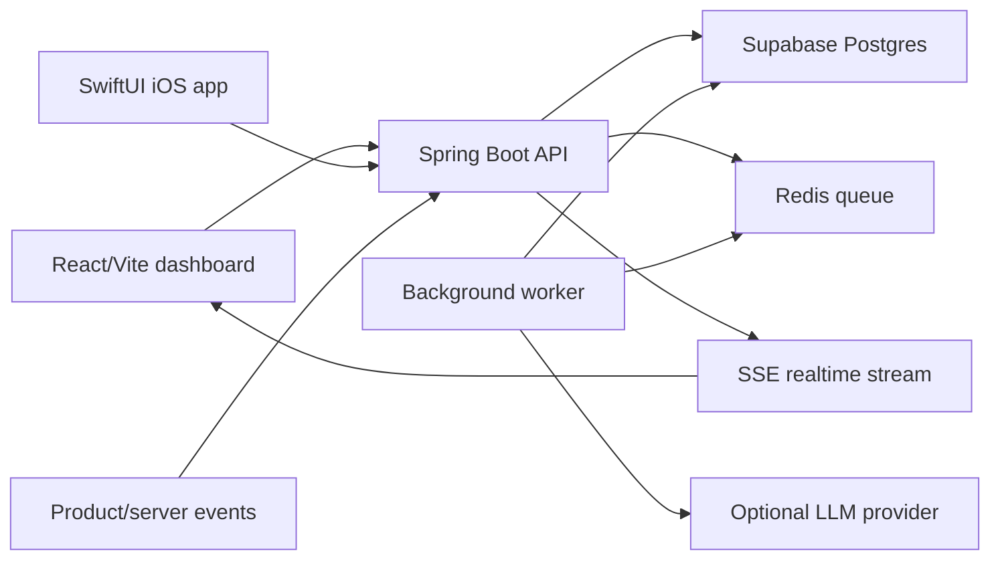

# Architecture

## Services

- `apps/web`: React/Vite dashboard, API client, responsive UI.
- `apps/api`: Spring Boot service with event ingestion, analytics, incidents, tasks, Actuator, and Flyway.
- `apps/ios`: SwiftUI client for mobile operations workflows.
- `supabase/migrations`: Database schema for local Postgres or Supabase.
- `infra/docker`: Local Postgres and Redis.

## Data flow

1. A product sends an event to `POST /v1/events`.
2. The API validates and persists the raw event.
3. A background job aggregates metrics and checks alert rules.
4. The dashboard reads account health, incidents, and trends.
5. Optional AI summaries can be generated for incidents.

## Design choices

- Raw event storage is append-only for replay and debugging.
- Aggregates are materialized to avoid expensive dashboard queries.
- Incidents are first-class entities, not just log lines.
- AI summaries are generated from internal facts and stored with provenance.
